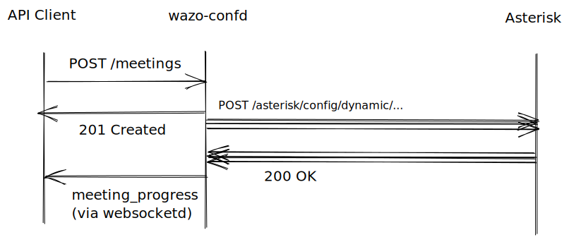

| Key | Value |
| ---: | :--- |
| **Title** | wazo-confd Transactions & events |
| **Number** | 0007 |
| **Date** | 2021-10-18 |
| **Authors** | Sebastien Duthil <sduthil@wazo.io>, Pascal Cadotte Michaud <pcm@wazo.io> |
| **Status** | draft |

## Abstract

wazo-confd: Add a notification about a new configuration being applied and usable.

## Motivation

When changing configuration in wazo-confd, Wazo Platform needs some time to
apply the new configuration in other components, most notably for Asterisk to
reload its configuration files. When creating time-sensitive resources in
wazo-confd, e.g. meetings that can be used right away, the client needs to be
notified as soon as the resource is effectively created and usable. This WPEP
discusses mechanisms of such a notification.

## State of the art in Wazo Platform

Async API are currently used in Wazo Platform:

* wazo-provd provisioning plugin installation
  * Returns a code 201 with an "installation ID" that must be polled later to know the progress of installation
* wazo-plugind Wazo Platform plugin installation
  * Returns a code 200, and subsequently sends multiple events `plugin_install_progress`
  
## Rejected propositions

* Use polling like wazo-provd
  * Polling is inefficient and a waste of resources. Pushing is a better notification model.
* Make wazo-confd requests synchronous with resource usability
  * This would make many requests much longer, about a 10x factor in the best cases.

## Proposition

New events are sent after the resource is created, the client may wait for them:

```js
{
  "name": "meeting_progress",
  "data": {
    "id": "1cdb8d4b-54bf-4ae7-a37f-e221de67549f",
    "status": "ready",  // or "in_progress" or "error" or any other relevant value
    "requester_uuid": "7eb32c9d-8e63-402c-b0db-155e37a52707",
  }
}
```

The `meeting_progress` events notifies the client that the new resource(s) can be used without any further delay.

To avoid spamming, a client requesting transactions should be able to subscribe to only modifications it has itself started, not modifications started by other clients.

## Example

Considering a client

* configured with user UUID `28732736-22ea-4e3f-8333-8e137184676a`
* connected to a Wazo Platform WebSocket

Request for the creation of a meeting:

```http
POST /users/me/meetings

{
  "name": "Meeting with Alice"
}
```

Response:

```http
201 Created

{
  "uuid": "729cc830-0c41-4a12-9c63-46a66afb06b9",
  "name": "Meeting with Alice",
  ...
}
```

After a short while, the client receives on its WebSocket:

```
{
  "name": "meeting_progress",
  "data": {
    "id": "16c0d83d-4b96-4531-b4ec-4481c90f5f50",
    "status": "ready",
    "requester_uuid": "28732736-22ea-4e3f-8333-8e137184676a",
  }
}
```

## Implementations

### 1. Worker thread in wazo-confd with synchronous sub-requests


[Diagram source](https://excalidraw.com/#json=6690199459332096,xs1mnE5Z7dxE9w5UhQBabg)

### 1.b. (variant) Worker thread in wazo-confd with synchronous sub-requests via ARI



[Diagram source](https://excalidraw.com/#json=5828578486779904,IhMBjp0qynoCWK6LQ7yptA)

### 2. Async flow with only bus events


[Diagram source](https://excalidraw.com/#json=6313698700296192,5e0AML6D2OlS6-P2X-g4NAk)
